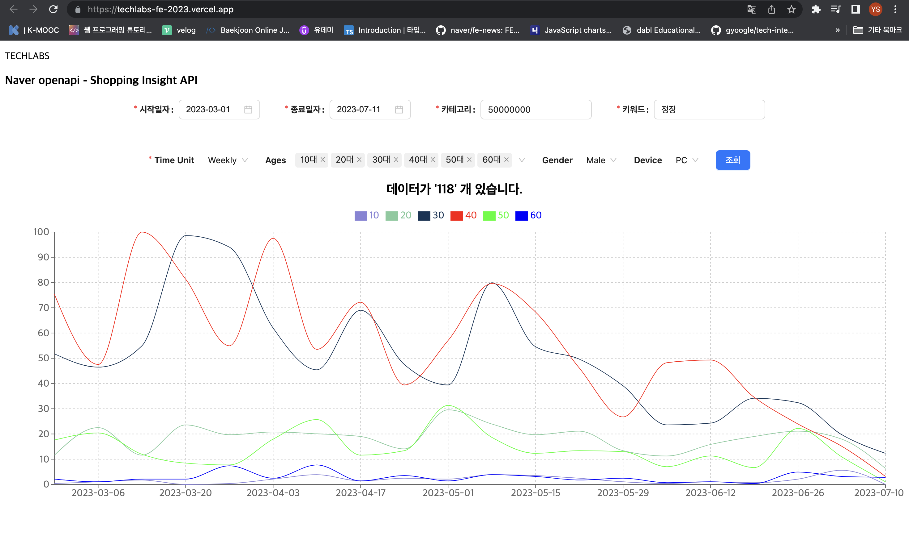

# 김윤수
배포 url : (https://chartproject.vercel.app/)
- **notice**: server 미가동 시, 데이터 불러오기 X
- 
 

# 빌드 방법
**1. repository 클론**

 `git clone https://github.com/snowriceDD/Naver_openAPI_ChartProject.git`

  

**2. 의존성 설치**
`client` , `server` 폴더 각각 → `yarn` or `yarn install`

 

**3. 환경 변수 세팅**
    1. `client` , `server` 폴더 각각 `.env` 파일 만들기
    2. 아래와 같은 양식으로 환경변수 입력
    
    
    VITE_APP_N_CLIENT_ID = 'key~~'
    VITE_APP_N_CLIENT_SECRET = 'key~~'
    VITE_APP_N_URL = 'https://openapi.naver.com/v1/datalab/shopping/category/keyword/age'
    
    
 

**4. server 실행**

`npx ts-node server.ts`

 

**5. client 실행**

`yarn start`

 

# 프로젝트 설명

배포 url : (https://chartproject.vercel.app/)
- **notice**: server 미가동 시, 데이터 불러오기 X

### 사용 기술
- React
- Typescript
- Redux Toolkit, Redux Persist
- Antd, Styled-Components
- reChart.js
- express, axios
- vite

### 프로젝트 설명
- Naver open API를 활용하여 사용자가 원하는 정보를 입력하여 조회할 수 있게 구현
- 조회한 데이터를 기반으로 ReChart 라이브러리를 활용하여 데이터 시각화
- Antd 라이브러리를 사용하여 Input Form 구성
- Input Form을 통해 조회했던 데이터를 저장하여 새로고침해도 소실되지 않게 처리
- vercel을 통해 client와 server 배포

### 이슈 사항
- 카테고리 넘버에 따라 받아오는 데이터가 극명하게 갈림
- naver 쇼핑 url에서 cat_id를 변경했을 땐, 많은 항목을 조회할 수 있었지만, 
    API를 통해 불러오는 data는 너무 적게 확인됨

 

## CORS 이슈 대응
1. PROXY server를 세팅하여 쇼핑인사이트 API 요청을 우회 처리했습니다.

 

# 선택 구현 사항
1. Antd를 사용해 Input Form을 구성했습니다.
2. Redux-Persist를 활용하여 웹사이트를 새로고침하더라도, 마지막으로 조회했던 파라미터가 남도록 했습니다.
3. Data Fetch를 Custom Hook으로 변경하여 사용했습니다.

 
2023.07.12
